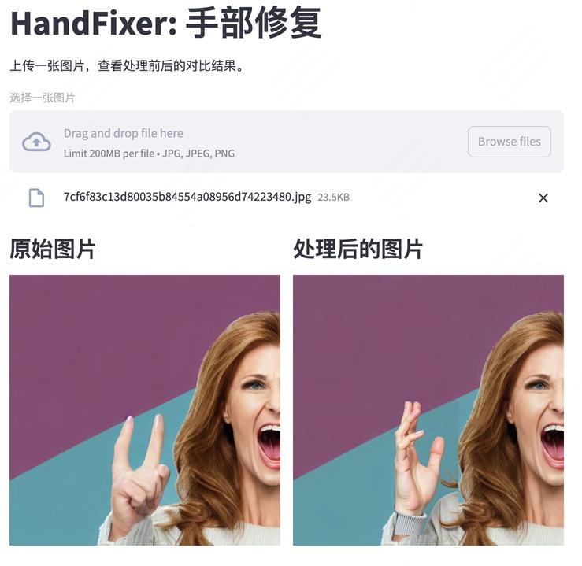

# HandFixer一键手部修复
## Introduction
This project addresses the issue of numerous hand defects in AI-generated portrait images by using a workflow based on FLUX/FLUX-Fill to correct hand deformities. It is effective for both real-life and anime images, including those generated by DiT/SDXL/Midjourney. It supports diffusers, gradio, ComfyUI, and more

本项目针对AI生成人像图片存在大量手部缺陷的问题，使用了一种基于FLUX/FLUX-Fill修复手部畸形的工作流，对真人图像和动漫图像均有效，包括由DiT/SDXL/Midjourney生成的图片；支持diffusers、gradio、ComfyUI等

## Results
- realistic images 真实感图片

|source| ORI | FIX | ORI | FIX |ORI | FIX  |
|------|-------|-------|-------|-------|-------|-------|
|sdxl|| |||||
|DiT|| |||||
- anime images 动漫图片

|source| ORI | FIX  | ORI | FIX  |ORI | FIX  |
|----|-------|-------|-------|-------|-------|-------|
|midjourney-v6.1|| ||||
|SFT-SDXL|||||||


## TODO
- [ ] Hand Pose/Depth Controlnet: use structure/anatomy conditions to reinforce genreation
- [x] ComfyUI workflow

## Quick Start 
```
pip3 install requirements.txt

python3 diffusers_pipeline.py \
    --pretrained_model_name_or_path='black-forest-labs/FLUX.1-dev' \
    --input_dir 'assets/examples' \
    --output_dir 'outputs'
```

## ComfyUI Workflow
1. "Download HandFixer to `ComfyUI/custom_nodes/` and install the requirements." 
下载HandFixer到`ComfyUI/custom_nodes/`并安装requirements
```
put HandFixer to ComfyUI/custom_nodes/
pip install -r requirements.txt
```
2. Ensure that the model components have been downloaded.
 确保模型组件已经下载

| Model Name  | File Name              | Installation Location            | Download Link      |
|-------------|------------------------|----------------------------------|--------------------|
| VAE | ae.safetensors	| ComfyUI/models/vae| [Download](https://huggingface.co/black-forest-labs/FLUX.1-schnell/blob/main/ae.safetensors)|
| CLIP Model  | clip_l.safetensors     | ComfyUI/models/clip              | [Download](https://huggingface.co/comfyanonymous/flux_text_encoders/blob/main/clip_l.safetensors)      |
|             | t5xxl_fp16.safetensors | ComfyUI/models/clip              | [Download](https://huggingface.co/comfyanonymous/flux_text_encoders/blob/main/t5xxl_fp16.safetensors)      |
| Flux Fill Model | fluxl-fill-dev.safetensors | ComfyUI/models/unet | [Flux Fill Release](https://huggingface.co/black-forest-labs/FLUX.1-Fill-dev) |

3. drag [workflow](workflow/HandFixer-fill.json) to ComfyUI. 将[workflow](workflow/HandFixer-fill.json)拖动到comfyUI


## Streamlit UI
models will be downloaded from huggingface automatically
```
streamlit run app_streamlit.py
```


## Gradio
```
python3 app_gradio.py
```

## Limitations
- The FLUX-dev model is not a custom inpainting model and may occasionally have boundary artifacts; FLUX-Fill is a dedicated inpainting model with better boundary handling, but the performance on generation decreases